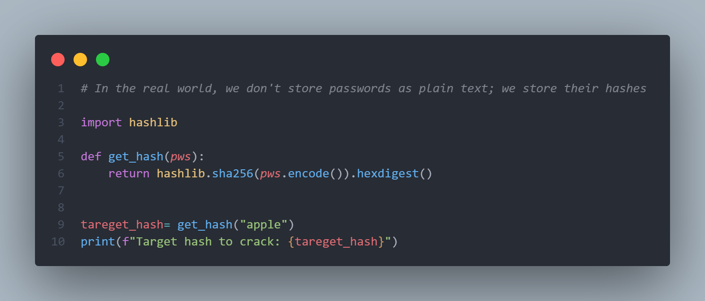
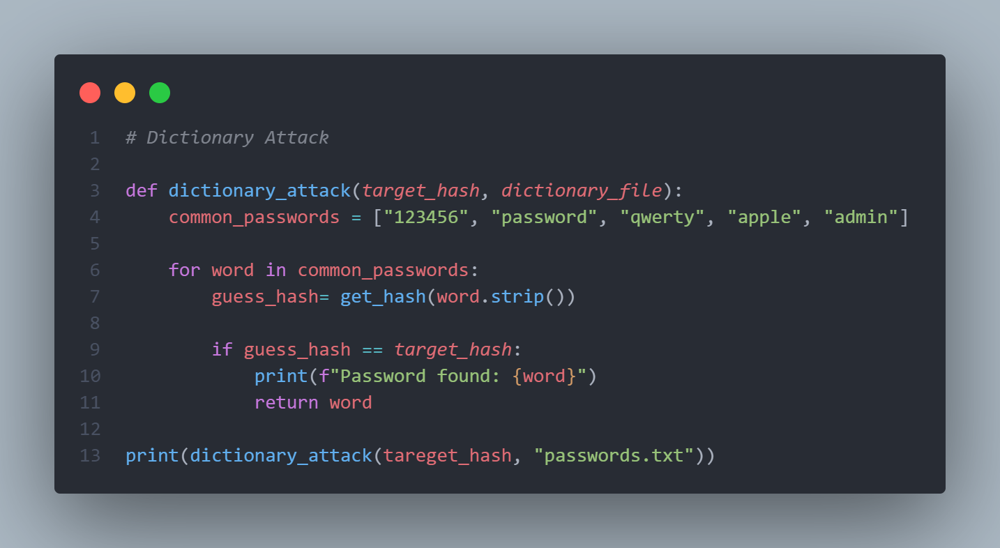
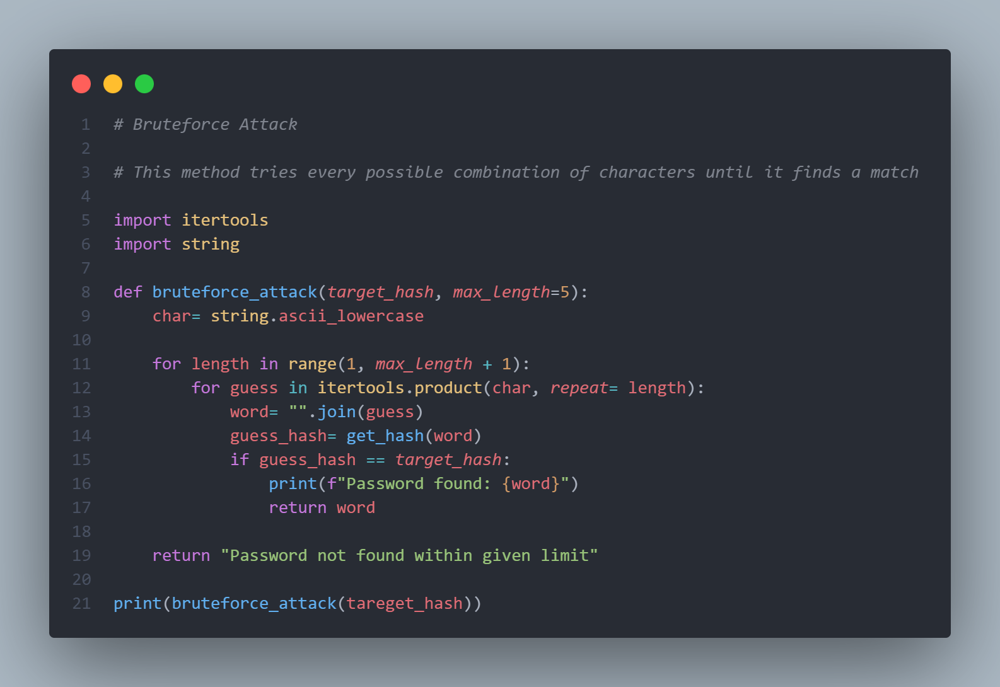

# Implement the following Attack in Java/Python:

## 1. Dictionary Attack

## 2. Brute Force Attack

## Aim

A database has been breached, and you have recovered a **SHA-256 Hash**. You need to write a Java/Python program that uses a **Dictionary Attack** to find the original password.

## 🧠 Key Concepts to Remember

- **SHA-256:** A cryptographic hash function that produces a 256-bit (64 character) signature.
- **One-way function:** You cannot "decrypt" a hash; you can only guess and compare.
- **Dictionary Attack:** Using a list of likely passwords to find a match.

1.  What's hashlib
    hashlib is a built-in Python library.

    It provides cryptographic hash functions like:

    1. MD5
    2. SHA-1
    3. SHA-256

    - pws → password string (example: "apple")
    - pws.encode() → converts string to bytes (required for hashing)
    - hashlib.sha256(...) → creates a SHA-256 hash object
    - .hexdigest() → converts the hash to a readable hexadecimal string

    - Same input → same hash every time

    - SHA-256 takes any input and produces a 64-character hexadecimal string (256 bits).

    **What is SHA-256?**

        - SHA-256 is a one-way cryptographic hash function that converts input data into a 256-bit fixed-size hash, ensuring data integrity and security.
        - Used in password hashing, blockchain, digital signatures

2. Dictionary Attack

   A dictionary attack is a password-cracking technique where commonly used passwords are hashed and compared with a stored hash.

   How it works: Think of this as Instead of guessing every possible combination, we are just try a list of common passwords (like "123456" or "apple")

Step 1: Look at the first word in the list.
Step 2: Hash that word.
Step 3: Does the hash match our target? If yes, we found it!

3. Brute Force Attack

   A brute force attack tries all possible combinations of characters until the correct password is found.

   How it works: This is the "Determined Attacker." They try every single possible combination of letters until they hit the right one.

Length 1: a, b, c... z
Length 2: aa, ab, ac... zz

Why it's slow: As the password gets longer, the number of combinations becomes billions or trillions.

